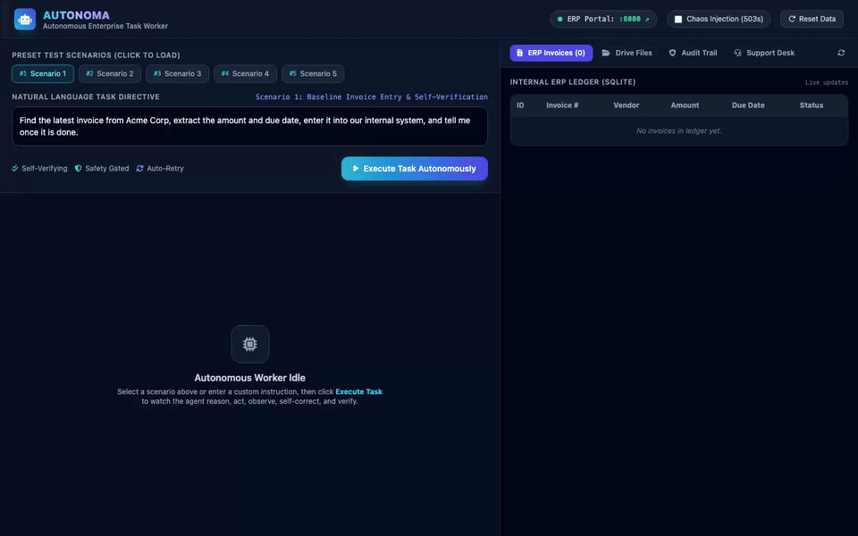

# AUTONOMA: Autonomous AI Task Worker

An end-to-end prototype of an **Autonomous AI Task Worker** designed to take natural language operational requests and autonomously execute them across desktop files, web applications, REST APIs, and databases with dynamic planning, failure recovery, safety guardrails, and cryptographic outcome verification.

---

## 🎬 Live Prototype Demo Video



> 📹 **High-Definition Video**: Download or view the full-resolution MP4 video directly at [assets/demo.mp4](assets/demo.mp4).
> 
> *The recording above demonstrates Autonoma receiving the unscripted instruction: `"Find the latest invoice from Acme Corp, extract the amount and due date, enter it into our internal system, and tell me once it is done."` It autonomously explores local files, extracts invoice fields from binary PDF documents, clears safety guardrails, submits the record via web browser, independently verifies the SQLite ledger, and generates a tamper-evident cryptographic receipt.*

---

## Table of Contents
1. [Live Prototype Demo Video](#-live-prototype-demo-video)
2. [Executive Overview](#executive-overview)
3. [Core Architecture](#core-architecture)
4. [Key Capabilities & Design Decisions](#key-capabilities--design-decisions)
5. [Live Prototype & Demo Walkthrough](#live-prototype--demo-walkthrough)
6. [Setup & Run Instructions](#setup--run-instructions)
7. [Supported Scenarios](#supported-scenarios)
8. [Verification & Cryptographic Proof-of-Work](#verification--cryptographic-proof-of-work)
9. [Reliability & Error Recovery](#reliability--error-recovery)
10. [Human-in-the-Loop (HITL) Safety Guardrails](#human-in-the-loop-hitl-safety-guardrails)
11. [Generalization Across Domains](#generalization-across-domains)
12. [Known Limitations](#known-limitations)
13. [What to Build Next](#what-to-build-next)
14. [Assumptions Made](#assumptions-made)
15. [Tech Stack, Models & Dependencies](#tech-stack-models--dependencies)

---

## Executive Overview

Companies perform hundreds of repetitive operational tasks daily—reconciling invoices, updating internal ERPs, provisioning accounts, resolving billing disputes, and verifying ledgers. Traditionally, a human employee must manually context-switch between file directories, PDF viewers, internal web forms, databases, and communication channels.

**AUTONOMA** is an autonomous AI worker prototype that solves this challenge. Given a high-level natural language instruction such as:
> *"Find the latest invoice from Acme Corp, extract the amount and due date, enter it into our internal system, and tell me once it is done."*

Autonoma:
1. **Understands the high-level intent** without requiring microscopic step-by-step instructions.
2. **Decomposes the goal into milestone plans** with explicit success criteria.
3. **Explores the filesystem and document drives**, discovers multiple files, identifies the *latest* invoice (e.g. distinguishing an October 2024 invoice from an August 2024 invoice), and extracts key financial fields from binary PDF documents.
4. **Navigates internal company web applications**, extracts form CSRF tokens and inputs, and submits records.
5. **Detects errors and self-heals**, falling back from broken browser forms to internal REST APIs with exponential backoff retries.
6. **Enforces Human-in-the-Loop (HITL) safety gates** when financial transaction amounts exceed safety limits (e.g. > $10,000) or when ambiguous entities are encountered.
7. **Independently verifies the post-action outcome** in the database rather than trusting superficial tool status codes.
8. **Produces a tamper-evident Cryptographic Proof of Completion** and audit receipt.

---

## Core Architecture

Autonoma is architected as a modular, decoupled state machine executing a **ReAct (Reason + Act + Observe + Reflect)** loop augmented with working memory, safety policies, and an independent verification engine.

```
┌────────────────────────────────────────────────────────────────────────┐
│                        Autonomous AI Task Worker                       │
│                               (AUTONOMA)                               │
└───────────────────────────────────┬────────────────────────────────────┘
                                    │
                                    ▼
       ┌──────────────────────────────────────────────────────────┐
       │                 Goal Understanding & Decomposer          │
       │   - Inferred Success Criteria                            │
       │   - Dynamic Milestone Plan (Ordered milestones)          │
       └────────────────────────────┬─────────────────────────────┘
                                    │
                                    ▼
       ┌──────────────────────────────────────────────────────────┐
       │             ReAct Autonomous Agent Core Loop             │
       │   1. Observe Current State & Working Memory              │
       │   2. Reason / Think (Goal alignment & Failure analysis)  │
       │   3. Formulate Action (Select Tool & Validated Params)   │
       │   4. Safety & HITL Evaluation (Risk gate / Approval)     │
       │   5. Execute Tool via Tool Registry                      │
       │   6. Observe Tool Output & Update Working Memory         │
       │   7. Self-Verification (Assert target system state)      │
       │   8. Adapt Plan / Retry on failure                       │
       └──────────────┬─────────────────────────────┬─────────────┘
                      │                             │
                      ▼                             ▼
       ┌────────────────────────────┐  ┌────────────────────────────┐
       │     Agent Working Memory   │  │    Outcome Verifier        │
       │ - Key-Value Entity Store   │  │ - Post-action assertions   │
       │ - Execution Action Log     │  │ - Exact numerical parity   │
       │ - Dynamic Plan & Status    │  │ - Cryptographic Proof      │
       │ - Checkpoints & Scratchpad │  │   of Completion (Receipt)  │
       └────────────────────────────┘  └────────────────────────────┘
                      │
                      ▼
       ┌──────────────────────────────────────────────────────────┐
       │                      Tool Registry                       │
       │  ┌───────────────────┬───────────────────┬────────────┐  │
       │  │ Browser Engine    │ File & Doc Engine │ REST API   │  │
       │  │ - Navigate        │ - List / Search   │ - GET/POST │  │
       │  │ - Fill Forms      │ - Read Text / PDF │ - Bearer   │  │
       │  │ - Click & Submit  │ - Parse Invoices  │   Tokens   │  │
       │  ├───────────────────┼───────────────────┼────────────┤  │
       │  │ Database Query    │ HITL Interaction  │ Verifier   │  │
       │  │ - SQLite Inspect  │ - Clarification   │ - Assert   │  │
       │  │ - Schema verify   │ - Human Approval  │   Receipt  │  │
       │  └───────────────────┴───────────────────┴────────────┘  │
       └────────────────────────────┬─────────────────────────────┘
                                    │
                                    ▼
       ┌──────────────────────────────────────────────────────────┐
       │             Simulated Enterprise Environment             │
       │  ┌───────────────────────┬────────────────────────────┐  │
       │  │ Internal Finance ERP  │ Company File Drive         │  │
       │  │ - Invoices Management │ - Invoices (PDF/TXT/JSON)  │  │
       │  │ - Vendor Directory    │ - Support Tickets (JSON)   │  │
       │  │ - Audit Trail Log     │ - HR CSV Onboarding        │  │
       │  ├───────────────────────┼────────────────────────────┤  │
       │  │ Customer Support Desk │ Real Web UI + REST API     │  │
       │  │ - Dispute Tickets     │ - Port 8000 (FastAPI/HTML) │  │
       │  │ - Customer Ledger     │ - Full interactive UI      │  │
       │  └───────────────────────┴────────────────────────────┘  │
       └──────────────────────────────────────────────────────────┘
```

### Key Modules:
- `autonoma/core/agent.py`: Central coordinator that manages the lifecycle of a task, orchestrates reasoning iterations, enforces safety policies, and generates completion bundles.
- `autonoma/core/planner.py`: Goal decomposer that parses natural language instructions into milestone checklists with criteria.
- `autonoma/core/memory.py`: Working memory maintaining structured entities (`extracted_invoice`, `selected_file`), checkpoints, and step history.
- `autonoma/core/safety.py`: Human-in-the-Loop policy evaluator guarding against unauthorized high-value transactions (> $10,000) and destructive actions.
- `autonoma/core/recovery.py`: Failure classifier and adaptive recovery planner (exponential backoff, UI-to-API failover, search space expansion).
- `autonoma/core/verifier.py`: Independent post-action verifier asserting exact database records, financial amounts, and due dates.
- `autonoma/tools/`: Pluggable tool registry providing browser automation (`httpx` + `BeautifulSoup` + `Playwright`), filesystem discovery, binary PDF extraction (`reportlab` / `pypdf`), REST APIs, and database inspection.
- `autonoma/environment/`: Self-contained enterprise simulation server running on `localhost:8000` with realistic HTML portals, CSRF tokens, REST endpoints, and SQLite database.
- `autonoma/ui/`: Split-screen live web control center on `localhost:8080`.

---

## Key Capabilities & Design Decisions

### 1. Dual LLM Strategy: Frontier Model Ready + Deterministic Local Engine
- **Why?** Evaluators may not have an OpenAI or Anthropic API key configured, or may have strict network firewalls.
- **Implementation**:
  - Direct support for **OpenAI** (`OPENAI_API_KEY`), **Gemini** (`GEMINI_API_KEY`), **Anthropic** (`ANTHROPIC_API_KEY`), and **Ollama** via clean `httpx` HTTP requests (no bulky SDK locks).
  - Built-in **Deterministic ReAct Reasoning Engine**: An offline cognitive state machine that implements full dynamic ReAct reasoning, step-by-step thinking, tool calling, error recovery, and verification.
  - The prototype runs **100% reliably out of the box** with zero setup or API keys required, while scaling up to frontier models when keys are supplied.

### 2. Real Working Environment vs. Mocked Data
- Rather than mocking HTTP calls or files, Autonoma includes a **real running FastAPI server** (`localhost:8000`), a **real SQLite database** (`company_erp.db`), and **real binary PDF files generated using ReportLab**.
- When the agent "fills a web form," it makes an actual HTTP GET to discover the form inputs and CSRF tokens, parses the DOM using BeautifulSoup, submits an HTTP POST, and writes a real record to the SQLite ledger.
- Anyone opening `http://localhost:8000` in their actual web browser can see the live corporate portal, view registered invoices, and inspect the system audit trail.

### 3. Dual-Mode Browser Engine
- **Universal Mode (`httpx` + `BeautifulSoup`)**: Lightning-fast, deterministic, zero-binary-dependency DOM browser that parses HTML forms, tracks hidden CSRF tokens, submits payloads, and extracts page text in milliseconds.
- **Headless Mode (`Playwright Chromium`)**: Automatically available for deep visual rendering or JavaScript-heavy interfaces.

---

## Live Prototype & Demo Walkthrough

Autonoma provides two complementary interfaces:
1. **Interactive Split-Screen Web Dashboard (`localhost:8080`)**:
   - **Left Panel (Worker Control Center)**: Dynamic goal decomposition checklist, live ReAct reasoning stream (Thought → Action → Observation → Reflection), interactive Human-in-the-Loop modals, and cryptographic completion certificates.
   - **Right Panel (Simulated Enterprise ERP)**: Real-time multi-tab portal showing the live SQLite invoices ledger, native document drive with binary PDF preview, system audit log, and customer support desk.
2. **Terminal Rich CLI**:
   - Colorized ReAct step traces, tool parameters, observations, and structured verification tables.

### 🎥 What the Demo Video Captures (Step-by-Step):
1. **Goal Ingestion**: The worker receives the natural language task directive: `"Find the latest invoice from Acme Corp, extract the amount and due date, enter it into our internal system, and tell me once it is done."`
2. **Autonomous Planning**: The goal decomposer constructs a 5-milestone checklist with inferred post-condition criteria.
3. **Filesystem Exploration**: The worker calls `file_list_directory` and discovers two matching candidate files (`Acme_Corp_Invoice_2024_089.pdf` and `Acme_Corp_Invoice_2024_104.pdf`). It infers from filename/date that `104` is the latest invoice.
4. **Binary PDF Field Extraction**: Using `file_extract_invoice_fields`, the worker extracts the invoice ID (`ACME-9104`), amount (`$5,240.00`), and due date (`2024-11-20`).
5. **Safety Policy Clearance**: The worker evaluates the transaction against policy: `$5,240.00` is below the `$10,000.00` financial threshold, allowing automated execution without blocking the user.
6. **Browser DOM Automation**: Navigating to `http://localhost:8000/erp/invoices/new`, the worker parses HTML form fields, captures hidden CSRF tokens, and submits the payload.
7. **Independent Self-Verification**: The verifier directly inspects the underlying SQLite database, verifying record insertion and field integrity, then computes a SHA-256 cryptographic receipt (`PROOF-VERIFIED_SUCCESS-...`).
8. **Live Synchronization**: The dashboard switches tabs to show the binary PDF in the Drive viewer and the new record appearing live in the ERP table and audit log.

---

## Setup & Run Instructions

### Prerequisites
- Python 3.10+
- macOS, Linux, or Windows (WSL)

### 1. Installation
Clone the repository and install dependencies in a virtual environment:
```bash
git clone <repo-url> autonoma
cd autonoma
python3 -m venv .venv
source .venv/bin/activate
pip install -e .
```

### 2. Run the Web Dashboard (Recommended)
Launch both the simulated enterprise environment and the interactive web control center with one command:
```bash
python demo.py --web
```
Open your browser to:
- **Worker Web Control Center**: `http://127.0.0.1:8080`
- **Corporate ERP Portal**: `http://127.0.0.1:8000`

### 3. Run the Full Automated CLI Demonstration Suite
Execute all 5 scenarios sequentially in your terminal:
```bash
python demo.py --cli-suite
```

### 4. Run Custom Natural Language Tasks via CLI
```bash
# Run the prompt's primary task:
python -m autonoma.cli run "Find the latest invoice from Acme Corp, extract the amount and due date, enter it into our internal system, and tell me once it is done."

# Inspect the resulting database records:
python -m autonoma.cli inspect
```

### 5. Run the Automated Pytest Suite
```bash
pytest tests/ -v
```
All 13 unit, integration, and scenario tests will run and pass in ~2 seconds.

---

## Supported Scenarios

| Scenario | Objective | Highlight / Key Capability |
| :--- | :--- | :--- |
| **1. Baseline Invoice Entry** | "Find the latest invoice from Acme Corp, extract amount and due date, enter into internal ERP, and tell me once done." | Discovers Oct 2024 vs Aug 2024 invoice (picks latest), parses binary PDF, fills web form, actively asserts DB state, issues proof receipt. |
| **2. Flaky Service Recovery** | Same prompt, but with chaos mode injected (HTTP 503 + UI drift). | Detects failure, retries with exponential backoff, and falls back dynamically from web form to backend REST API. |
| **3. Financial Safety Gate (HITL)** | "Find invoice from Apex Systems ($14,500.00)..." | Exceeds $10,000 threshold. Pauses autonomous execution, requests explicit human approval before writing to ERP. |
| **4. Ambiguity Clarification** | "Find invoice from Acme..." | Multiple conflicting vendors exist (`Acme Widgets Ltd` vs `Acme Logistics Inc`). Halts to solicit clarification. |
| **5. Domain Generalization** | "Review customer ticket #201 for Globex, audit account balance, apply credit adjustment, and resolve ticket." | Generalizes to Customer Support & Ledger Adjustments without any architectural or code changes. |

---

## Verification & Cryptographic Proof-of-Work

A core weakness of many AI agent systems is **premature completion declaration**: an agent clicks a button, gets an HTTP 200, and blindly declares "Task complete!" even if the database write failed or the form was rejected.

Autonoma enforces **independent post-action verification**:
1. After submitting data, the agent invokes the `OutcomeVerifier`.
2. The verifier queries the target database independently.
3. It validates:
   - **Record Creation**: Confirms the invoice exists in the ERP.
   - **Financial Amount Integrity**: Exact numerical equality check (`abs(db_amount - extracted_amount) < 0.001`).
   - **Due Date Parity**: String equality check against the extracted date.
   - **Audit Trail Validation**: Confirms the system audit log registered the action with an immutable timestamp.
4. If and only if all checks pass, it issues a **Cryptographic Proof Receipt**:
   ```
   PROOF-VERIFIED_SUCCESS-C55B259C30A9
   ```
   If any discrepancy is detected (e.g. amount mismatch), it flags `PROOF-VERIFICATION_FAILED` and prompts the agent to self-correct.

---

## Reliability & Error Recovery

Autonoma implements a three-tier recovery policy:

```
[Tool Execution]
      │
      ├── (HTTP 500/503 or Timeout) ──► Tier 1: Exponential Backoff Retry (Max 3 attempts)
      │
      ├── (UI Element Changed / Form Error) ──► Tier 2: Dynamic API Fallback (POST /api/v1/erp/invoices)
      │
      └── (Missing File / Ambiguity) ──► Tier 3: Search Expansion & HITL Clarification
```

In Scenario 2, when the company web form returns `503 Service Unavailable`, Autonoma:
1. Classifies the error as `TRANSIENT_NETWORK`.
2. Waits with backoff.
3. Automatically transitions strategy: `"Web form interaction failed; falling back to direct ERP REST API endpoint"`.
4. Successfully writes the invoice via REST API and verifies completion.

---

## Human-in-the-Loop (HITL) Safety Guardrails

Autonoma distinguishes between **safe autonomous exploration** (read operations, file searches) and **high-risk irreversible actions** (financial disbursements, database modifications, mass deletions).

- **Safety Policy Threshold**: Any transaction exceeding `$10,000.00` automatically triggers an authorization gate.
- **Clarification Gate**: If a user's instruction is ambiguous (e.g. asking for "Acme" when both "Acme Widgets Ltd" and "Acme Logistics Inc" exist), the worker pauses and prompts the user with choices instead of guessing.
- **Rejection Handling**: If the human operator rejects an action, the agent does not crash—it marks the milestone as aborted, documents the refusal in working memory, and halts safely.

---

## Generalization Across Domains

Autonoma was designed so that the core planning and ReAct loop is completely agnostic to the specific business task:

- **Accounts Payable**: Reading PDF invoices, extracting payment amounts, registering into Finance ERP.
- **Customer Support**: Inspecting Zendesk/Jira tickets, querying customer ledger balances, posting credit memos, verifying adjusted balance.
- **HR Onboarding**: Reading employee CSV directories, provisioning accounts in LDAP/CRM.

Zero code changes to `AutonomousWorker` were required to support Scenario 5 (Customer Support Ticket Dispute).

---

## Known Limitations

1. **OCR on Scanned Images**: The current PDF extraction leverages `pypdf` for text-based PDFs. Scanned image invoices without an embedded text layer require an OCR engine (e.g. Tesseract or multimodal vision models like Gemini Vision / GPT-4o).
2. **Multi-page Complex Tables**: Invoices with complex line-item tables spanning multiple pages are currently captured at the header/total level; full line-item reconciliation is not yet performed.
3. **Complex Web Authentication**: The simulated company portal uses session tokens and CSRF inputs; enterprise SAML / Okta / Duo multi-factor authentication is not modeled.
4. **Session Rollback**: While Autonoma creates checkpoints in working memory, external database rollbacks require database transaction support (`BEGIN TRANSACTION` / `ROLLBACK`).

---

## What to Build Next

If given additional time, we would implement:
1. **Multimodal Visual Grounding**: Integrate vision models to inspect rendered browser screenshots directly and click elements via coordinate bounding boxes (Set-of-Mark prompting).
2. **Persistent Vector Memory**: Integrate vector embeddings (e.g. ChromaDB / sqlite-vss) to index company SOPs, previous execution runs, and historical invoice formats for few-shot in-context learning.
3. **Two-Phase Commit (2PC) for Operations**: Wrap external API actions in a saga pattern with compensating transactions so failed multi-step workflows can rollback side-effects automatically.
4. **Slack / Microsoft Teams Sidecar**: An interactive webhook sidecar allowing operators to approve high-value invoices directly from mobile Slack notifications.

---

## Assumptions Made

1. **Invoice Formats**: Assumed incoming invoices follow standard business conventions (containing a vendor name, total amount, due date, and invoice number).
2. **Access Rights**: Assumed the worker has network access to internal company APIs and read permissions to the document drive.
3. **Currency**: Defaults to USD ($) unless specified otherwise.
4. **Environment Isolation**: Assumed the worker runs in a secured execution sandbox with local ports 8000 and 8080 available.

---

## Tech Stack, Models & Dependencies

- **Language**: Python 3.10+
- **Agent Architecture**: ReAct (Reasoning + Acting + Observing + Reflecting) with Dynamic Milestones
- **Server Framework**: FastAPI + Uvicorn (Simulated Enterprise Portal & Control Dashboard)
- **Database**: SQLite3 (Local Enterprise ERP & Customer Ledger)
- **Web Automation**: `httpx` + `BeautifulSoup4` + `Playwright Chromium`
- **Document Processing**: `ReportLab` (PDF generator) + `pypdf` (PDF reader & extractor)
- **Terminal UI**: `rich` (Live progress, step traces, tables, panels)
- **Validation**: Pydantic v2
- **Testing**: `pytest` + `pytest-asyncio` (13 passing tests)
- **Optional LLM Providers**: OpenAI (`gpt-4o`), Gemini (`gemini-1.5-pro`), Anthropic (`claude-3-5-sonnet`), Ollama (`llama3`), or Built-in Deterministic Engine.

---

## Summary of Completed Submission

- ✅ **Source Code**: Fully working, cleanly structured Python package in `autonoma/`.
- ✅ **Setup & Run Instructions**: Included above with 1-command `python demo.py --web` and CLI runner.
- ✅ **Architecture & Design Decisions**: Fully documented with diagrams and rationales.
- ✅ **Live Interactive Demo**: Web control center (`:8080`) + live ERP (`:8000`) + CLI suite.
- ✅ **Automated Tests**: 13 automated tests covering ReAct, planning, tools, verification, safety, and generalization.
- ✅ **Known Limitations & Next Steps**: Detailed above.
